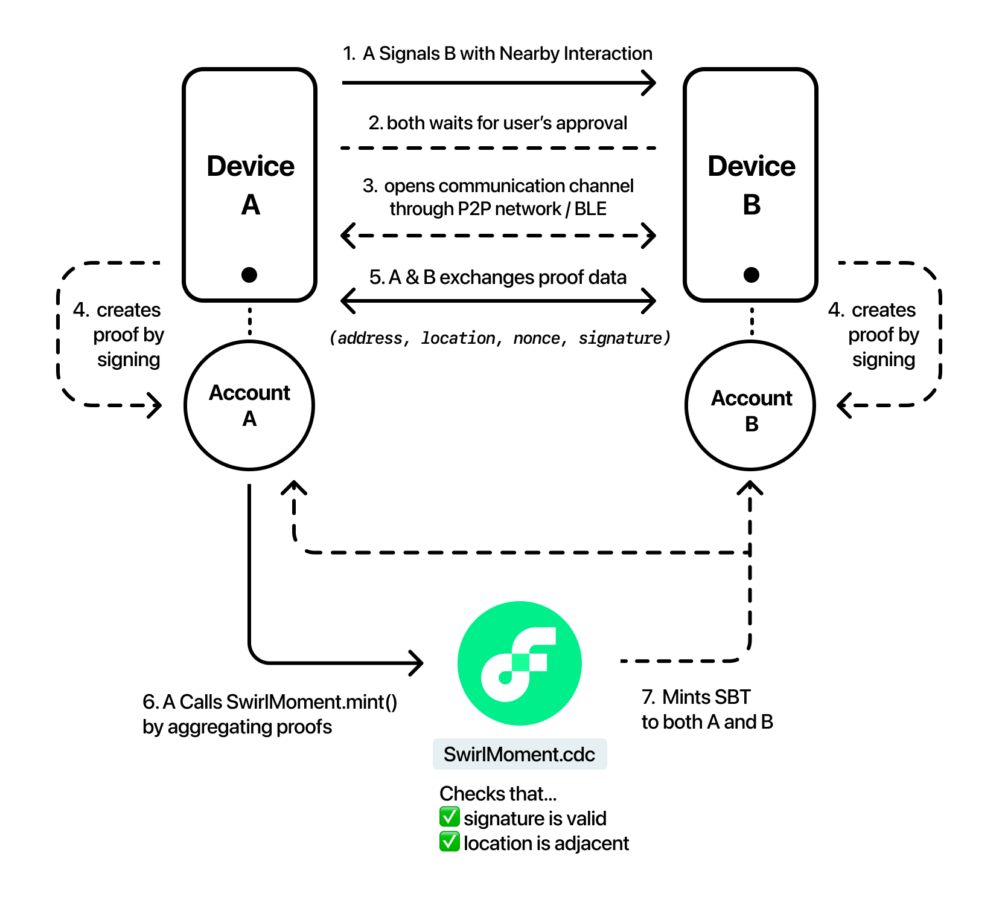

# Swirl Contracts

This repository contains contract codes of Swirl, a mobile nametag NFT sharing service leveraging [Nearby Interaction](https://developer.apple.com/documentation/nearbyinteraction) and appless & walletless onboarding.

It uses a special protocol called **Proof-of-Meeting** to verify that the participants are at the same time & location by signing their locations and exchange the signatures through Nearby Communication protocol.

### Deployed Contracts

Currently, the contracts are deployed only for the testnet.

#### Testnet

| Contract | Address |
|---|---|
| [`SwirlNametag`](./contracts/SwirlNametag.cdc) | `0x5969d51aa05825c4` |
| [`SwirlMoment`](./contracts/SwirlMoment.cdc) | `0x5969d51aa05825c4` |

### Projects Structure
 * `contracts/`: contains contract code
   * [**`SwirlNametag.cdc`**](./contracts/SwirlNametag.cdc): Stores users' profile info as namecard NFT.
   * [**`SwirlMoment.cdc`**](./contracts/SwirlMoment.cdc): Records the fact that one and another met IRL as SBT. It's being verified by **proof-of-meeting** mechanism. For details, see `SwirlMoment.mint()` method.

 * `queries/`: contains preset of Cadence code for reading contract data
 * `transactions/`: contains preset of Cadence code for writing contract data
   * `setup-and-mint-nametag.cdc`: Creates collections for both token and mints a `SwirlNametag`. transacted when a user onboards to Swirl.
   * `mint-moment.cdc`: Mints a `SwirlMoment` by providing proof-of-meeting data.
   * `update-nametag.cdc`: Updates a user's profile info.


### Proof-of-Meeting


## Getting Started

### Deploying Contract

### Emulator

The easiest way to try Swirl contracts is to deploy it on the emulator first—
you can deploy it with preconfigured key.

```
 $ flow emulator &
 $ flow project deploy -n=emulator
```

### Testnet

You need to set up your private key in `testnet-account.key` and edit the account in `flow.json`.

```
 $ flow generate keys
 $ flow project deploy -n=testnet
```

